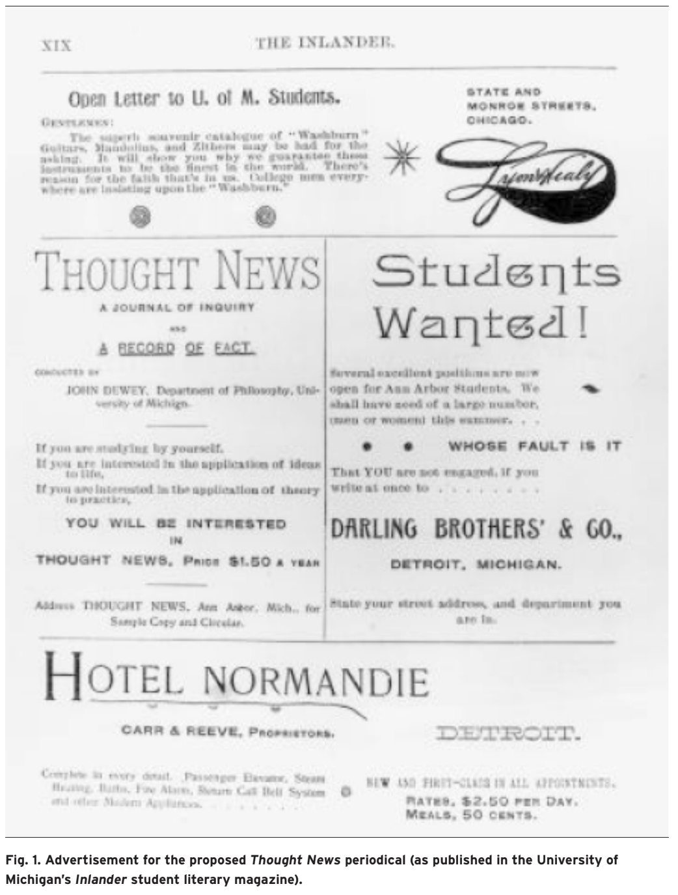

# Theory in the Archives: Fred Newton Scott and John Dewey on Writing the Social Organism    
### Jeremiah Dyehouse  
In April of 1892, the University of Michigan’s Inlander student literary maga- zine published the following advertisement:  If you are studying by yourself, If you are interested in the application of ideas to life, If you are interested in the application of theory to practice, YOU WILL BE INTERESTED IN THOUGHT NEWS, PRICE $1.50 A YEAR (Thought) Thought News, the advertised publication, was to have been “conducted” by John Dewey, then a young chair of the University of Michigan’s philosophy department (Thought). Other press communications about Thought News also identified the future pragmatist philosopher as responsible for the publication, which they described as a “Journal of Inquiry” and a new kind of newspaper (Thought; for example, “He’s  Planned”; Simonson @simonson2020short). This periodical project was actually a collaborative undertaking, involv- ing not only {term}`Dewey` but also a former journalist, newspaper editor, and entrepreneur named Franklin Ford; Ford’s brother Corydon; and a group of University of  Michigan academics including George Herbert Mead, Robert Ezra Park, and Fred Newton Scott.[^annarborgroup] 
Led partly by Dewey and partly by Franklin Ford, these Ann Arbor intellectuals imagined new possibilities for the writing infrastructures—telegraphs, cheap paper, and publication equipment—that subtended the late nineteenth-century newspaper. Their idea was to improve {term}`communication` between the differing parts of their society,

[^annarborgroup]: These guys got together in Ann Arbor, as this other source explains.

which they conceived as an organic entity poised on the verge n April of 1892, the University of Michigan’s Inlander student literary maga- zine published the following advertisement:  If you are studying by yourself, If you are interested in the application of ideas to life, If you are interested in the application of theory to practice, YOU WILL BE INTERESTED IN THOUGHT NEWS, PRICE $1.50 A YEAR (Thought) Thought News, the advertised publication, was to have been “conducted” by John Dewey, then a young chair of the University of Michigan’s philosophy department (Thought). Other press communications about Thought News also identified the future pragmatist philosopher as responsible for the publication, which they 

::::{figure} Theory_figure-1.png
:label: adTN
:alt: an advertisement fof the Thought News project
Advertisement for the proposed Thought News periodical
:::::

described as a “Journal of Inquiry” and a new kind of newspaper (Thought; for example, “He’s  Planned”; Simonson @simonson2020short). This periodical project was actually a collaborative undertaking, of  

which they conceived as an organic entity poised on the verge n April of 1892, the University of Michigan’s Inlander student literary maga- zine published the following advertisement:  If you are studying by yourself, If you are interested in the application of ideas to life, If you are interested in the application of theory to practice, YOU WILL BE INTERESTED IN THOUGHT NEWS, PRICE $1.50 A YEAR (Thought) Thought News, the advertised publication, was to have been “conducted” by John Dewey, then a young chair of the University of Michigan’s philosophy department (Thought). Other press communications about Thought News also identified the future pragmatist philosopher as responsible for the publication, which they also piut in their advertisement (), which they hate and love.

This is just the pure markdown operation: .

